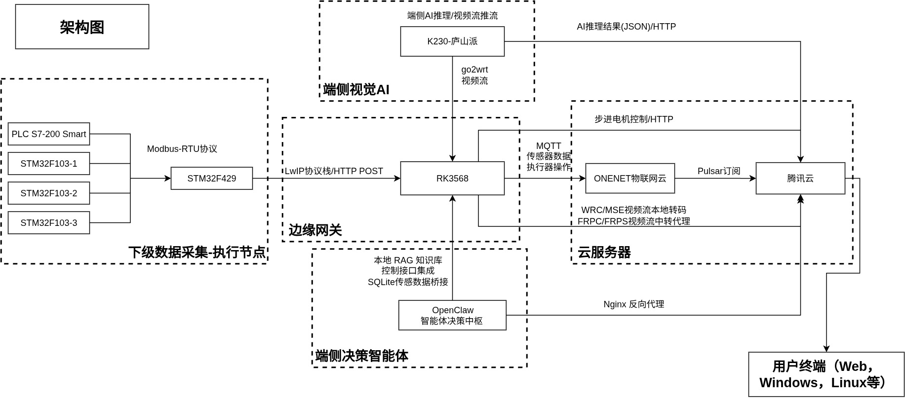
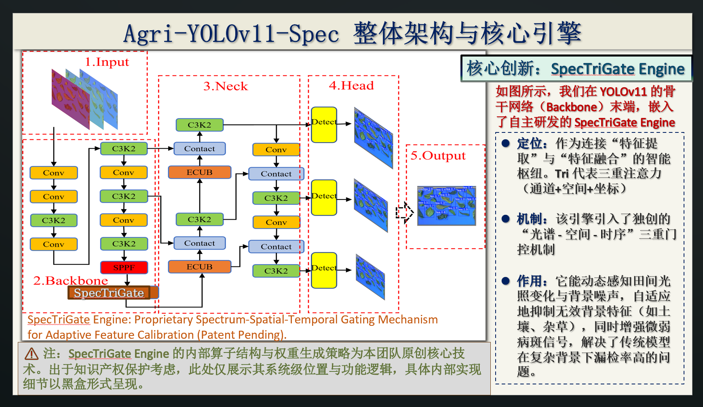

# 石斛智能培育边缘协同系统产品说明书

## 1. 项目背景与应用场景

霍山石斛属于高附加值中药材与功能性农业作物，对温湿度、光照、通风、病虫害控制和培育过程管理都有较高要求。传统培育方式普遍依赖人工巡棚、经验判断和分散式设备管理，存在以下典型痛点：

- 环境参数采集分散，温湿度、光照、气体浓度等数据缺少统一汇聚与持续记录。
- 病虫害识别依赖人工经验，发现滞后，容易错过最佳处置窗口。
- 现场设备、边缘节点、云端平台和应用终端之间链路割裂，难以形成闭环协同。
- 远程查看视频、理解环境变化、形成处置建议，通常需要切换多个系统，运维和管理成本高。
- 采集层、视觉层、决策层和应用层缺少统一架构，难以支撑后续智能化演进。

本项目围绕“石斛智能培育”场景，构建了一套面向温室/大棚的小型边缘协同系统，以 STM32 采集主站、K230 视觉终端、RK3568 边缘网关、OpenClaw 决策中枢和多架构跨平台客户端为核心，形成“采集感知、边缘汇聚、智能分析、统一交互”的完整链路。

## 2. 项目解决的核心问题

本项目重点解决了石斛培育场景中的四类问题：

### 2.1 解决异构设备数据难以统一汇聚的问题

系统使用 STM32F429 作为 Modbus-RTU 主站，对多类传感从站与 PLC 控制从站进行统一轮询，将光照、温湿度、气体浓度、设备状态等信息整合为统一的 `MODBUS_SNAPSHOT` 结构化数据，再由 RK3568 进行边缘汇聚与上行转发。

### 2.2 解决视觉巡检与环境数据割裂的问题

K230 在端侧直接完成视觉推理，并同时输出 RTSP 视频流与 AI JSON 检测结果。这样不仅能让用户看到实时画面，还能把视觉事件与环境传感数据一起交给边缘网关与决策中枢处理，实现多模态融合。

### 2.3 解决“有数据但不会决策”的问题

系统引入 OpenClaw 作为边缘侧智能决策中枢，不直接控制设备，而是将视觉、传感、历史记录和本地知识库结合，输出适用于霍山石斛培育场景的决策建议、解释性分析和可供应用层消费的结构化报告。

### 2.4 解决多终端访问与运维入口分散的问题

系统基于 Flutter 构建跨平台客户端，统一提供登录、工作台、视频中心、状态总览、AI 巡检、日志查看和运维设置等能力，让移动端、桌面端和 Web 端都能够用一致方式访问边缘系统。

## 3. 总体方案与系统架构

系统采用“端侧采集 + 边缘汇聚 + 本地智能 + 多端交互”的总体思路，核心目标是在不依赖重云端推理的前提下，完成现场数据整合、视觉识别、农业建议生成和远程交互。

从体系结构上看，本项目可以划分为四层：

- 采集与执行层：由 STM32F429、多个 F103 从站、PLC 控制从站和 K230 视觉终端构成，负责环境数据采集、设备状态读取和视频/视觉结果输出。
- 边缘汇聚层：由 RK3568 承担边缘网关角色，完成 HTTP 接入、视频分发、AI 结果缓存转发、外部平台桥接和农业上下文组装。
- 智能决策层：以 OpenClaw 为核心，通过 `agri-context-bridge` 将多源数据组织为可推理上下文，调用独立农业智能体 `agri-orchestrator` 形成建议、报告与问答结果。
- 应用与服务层：包括 Java 后端、浏览器控制台和 Flutter 跨平台客户端，负责展示、运维、问答交互和业务系统对接。

### 3.1 文字化数据流

系统的核心数据流如下：

1. STM32F429 轮询 Modbus-RTU 从站，生成统一环境快照。
2. K230 采集图像，执行 YOLO11 OBB 推理，同时输出 RTSP 视频流与 AI JSON。
3. RK3568 通过 `/api/uplink` 接收环境快照，通过 `/api/ai` 接收视觉检测结果，并由 `go2rtc` 拉取 RTSP 视频流向浏览器分发。
4. `agri-context-bridge` 将环境、视觉、历史报告和本地知识库内容归一化并汇总为农业上下文。
5. OpenClaw 的 `agri-orchestrator` 对上下文进行推理，生成建议性决策和人类可读说明。
6. Java 后端与 Flutter 客户端消费这些结果，为用户提供统一的监控、分析和交互入口。

### 3.2 当前说明文档的信息边界

由于 RK3568 设备当前未通电离线，本说明书中关于 RK3568 与 OpenClaw 的内容，采用以下依据整理：

- 当前分支代码结构与公开仓库说明；
- 本轮已确认的部署架构和模块职责；
- 已验证的接口、链路设计和系统行为；
- 已完成但不在本文展开的局部运维配置。

因此，本文定位为**产品说明书**，重点解释系统设计、模块价值与实现思路，不作为部署操作手册。

## 4. 关键模块实现

## 4.1 数据采集模块：STM32F429 Modbus-RTU 主站

数据采集模块是整个系统的基础输入层，也是执行链路的第一道控制入口。其核心职责不仅是统一管理环境传感数据和设备状态信息，还包括将边缘侧下发的执行意图转换为 PLC 可理解的 Modbus 命令，并把执行结果重新纳入统一快照，形成“采集 + 状态回读 + 控制回执”一体化的数据底座。

### 一页 PPT 总结版

**模块定位**

STM32F429 作为系统底层的 Modbus-RTU 主站，同时承担“环境数据采集”和“PLC 执行器控制落地”两项职责，是连接现场传感设备、执行机构与边缘网关的核心数据入口。

**核心能力**

- 统一轮询 3 个采集从站和 1 个 PLC 控制从站；
- 采集光照、温湿度、气体浓度等关键环境参数；
- 读取水泵、步进机构、位置脉冲、故障字等执行器状态；
- 接收边缘网关返回的 `pendingCommand`，写入 PLC 命令区并回读执行结果；
- 将环境数据、设备状态、控制结果统一封装为 `MODBUS_SNAPSHOT` 上报 RK3568。

**关键设计**

- 单总线单事务：保证 Modbus-RTU 通信稳定；
- 命令区与状态区分离：支持“下发控制 + 状态回读”闭环；
- 最新快照覆盖旧快照：保证系统始终面向当前环境做判断；
- 控制结果带序号回传：便于追踪每一次执行动作。

**模块价值**

- 为边缘网关提供统一、结构化、可持续更新的环境输入；
- 让 PLC 执行器从“不可见黑盒”变成“可观测、可追踪”的系统节点；
- 为后续半自动控制和 AI 驱动闭环执行预留稳定接口。

### 4.1.1 模块职责

- 作为 Modbus-RTU 主站轮询多个从站。
- 采集光照、温湿度、气体浓度等环境信息。
- 读取 PLC 控制从站状态，如泵、步进机构、位置脉冲、故障字等。
- 接收边缘网关返回的待执行控制命令，并串行写入 PLC 命令区。
- 将控制执行结果、设备状态和环境数据统一汇总到同一份快照中。
- 将采集结果汇总为统一快照，并通过 HTTP 上报到 RK3568。
- 为后续半自动控制和全自动闭环控制预留执行通道。

### 4.1.2 采集对象与寄存器组织

当前 F429 面向三类采集从站和一类控制从站：

- 从站 1：光照相关寄存器，如 `40001`。
- 从站 2：温度、湿度寄存器，如 `40011`、`40012`。
- 从站 3：MQ2 气体浓度寄存器，如 `40021`。
- 从站 4：PLC 状态区与命令区，如 `40031~40038` 状态寄存器、`40101~40108` 命令区。

其中 PLC 控制从站对应的是系统中的执行器层，主要面向：

- 水泵启停；
- 步进机构动作；
- 原点复位与位置控制；
- 控制结果码回读与状态字诊断。

命令区与状态区分离的设计，使系统既能下发控制动作，也能在同一轮轮询中确认“是否执行、执行到哪里、是否出错”，从而天然支持“环境采集 + 执行机构状态 + 控制结果回读”的一体化表达，而不是把数据和控制拆成完全割裂的两套总线逻辑。

### 4.1.3 任务模型与总线策略

采集模块建立在 FreeRTOS 任务模型之上，至少包含两类核心任务：

- `Task_Modbus`：负责固定顺序轮询各从站，读取寄存器、处理错误、更新快照。
- `Task_Uplink`：负责异步发送 uplink 队列中的 HTTP 消息。

其关键实现策略包括：

- 总线上任意时刻只保留一个未完成的 Modbus 事务，避免 RTU 时序冲突。
- 中断层只处理收发字节和 T3.5 定时通知，不把复杂状态机放进中断。
- 单从站异常只影响该从站状态，不阻塞整个采集循环。
- 轮询顺序固定，可预测，便于调试与追踪。
- 如果 uplink ACK 中存在 `pendingCommand`，则优先写入 PLC 命令区，再回读 PLC 状态区，确保控制动作与状态变化在同一周期内被观测到。

也就是说，STM32F429 在系统中并不是单纯“采集器”，而是承担了一个轻量执行调度角色：一方面持续轮询环境数据，另一方面串行、安全地把边缘侧命令落到 PLC 执行器上。

### 4.1.4 数据建模与上行方式

采集结果会被汇总为统一的 `MODBUS_SNAPSHOT` JSON，外层包含设备标识、消息编号、时间戳、事件类型等字段，内层 `payload` 则承载多从站的状态快照，例如：

- `cycleId`：当前采集周期编号；
- `slave1/2/3/4`：各从站在线状态、有效状态、最后错误、最近更新时间以及具体业务字段；
- PLC 状态会进一步展开为 `statusWord`、`faultWord`、`pumpState`、`stepperState`、`positionPulse` 等字段。
- 对于控制执行链路，还会保留 `lastCommandSeq`、`lastCommandResult`、`lastCommandResultCode` 等字段，用于标识最近一次执行命令的编号、结果和状态码。

这种统一快照的价值在于：

- 上游不用理解底层寄存器语义，只消费统一的 JSON 结构；
- 边缘网关、农业桥接服务和云端平台都可共用同一份数据模型；
- 后续增加新传感器类型或新的执行器类型时，只需扩展快照内容，不必重构整条链路。

### 4.1.5 PLC 控制执行器闭环

本项目在采集模块下纳入 PLC 控制执行器相关内容，核心目的不是直接在 MCU 端做复杂控制算法，而是为上层边缘系统提供一个稳定、可追踪、可审计的执行落点。

控制闭环的基本流程为：

1. RK3568 在 `POST /api/uplink` 的成功响应中按需附带 `pendingCommand`；
2. STM32F429 从 HTTP ACK 中解析命令序号、命令码和参数；
3. `Task_Modbus` 优先将命令写入 PLC 对应命令寄存器区；
4. 同一轮周期内回读 PLC 状态寄存器区；
5. 将泵状态、步进机构状态、位置脉冲、最近命令序号和结果码一并写入最新快照；
6. RK3568、业务后端或智能体据此判断执行结果与设备状态。

这一设计带来三点价值：

- 控制链路可追踪：每一条下行命令都有对应的序号与结果回读；
- 执行状态可观测：执行器不是黑盒，而是与环境数据一起进入统一监控体系；
- 后续闭环可扩展：未来无论是人工下发、规则引擎触发，还是 AI 建议转执行，都可以复用这条安全的控制落地链路。

### 4.1.6 队列覆盖策略

采集快照上报采用“最新快照覆盖旧快照”的策略：

- 如果队列中已有待发的旧快照，新快照会覆盖旧快照；
- 正在发送中的那一条不被覆盖；
- 发送完成后，队列始终尽可能保留最新状态。

这非常适合温室环境数据场景，因为运维人员和智能体通常更关心“当前环境”，而不是一串已过时、堆积在队列里的历史状态。

## 4.2 边缘网关：RK3568 多路汇聚与分发中枢

RK3568 是整个系统的边缘汇聚中心，也是“数据进入系统”和“系统对外提供能力”的关键节点。

### 一页 PPT 总结版

**模块定位**

RK3568 是系统的边缘协同中枢，负责把环境采集、视觉识别、视频分发、智能分析与业务服务统一汇聚到同一个边缘节点上。

**核心能力**

- 接收 STM32 上报的 `MODBUS_SNAPSHOT`；
- 接收 K230 上送的 AI JSON 检测结果；
- 通过 `go2rtc` 拉取 RTSP 并提供 WebRTC / MSE / HLS 播放；
- 通过 `agri-context-bridge` 组织农业上下文并调用 OpenClaw；
- 向 Java 后端、浏览器控制台和客户端提供统一边缘入口。

**关键设计**

- 数据链、视频链、AI 链在 RK3568 侧统一收口；
- `edgelink-gateway` 与 `agri-context-bridge` 职责独立，便于维护和扩展；
- 边缘网关同时支持本地访问与公网访问，具备现场部署灵活性；
- OneNET、视频中心、农业智能体可共享同一边缘数据底座。

**模块价值**

- 将多源异构设备能力整合为统一服务平台；
- 让业务后端与客户端不必直接面向底层设备协议；
- 为后续扩展更多设备、更多模型和更多业务系统提供中枢节点。

### 4.2.1 模块职责

RK3568 侧并不是单一程序，而是由多个彼此配合、职责隔离的服务组成：

- `edgelink-gateway`：负责接收 STM32 环境快照与 K230 AI 结果；
- `go2rtc`：负责拉取 K230 RTSP 主码流，并向浏览器提供 WebRTC / MSE / HLS；
- `agri-context-bridge`：负责农业上下文归一化、存储和 OpenClaw 调用；
- OpenClaw Gateway：负责控制台、智能体和农业问答控制平面；
- 反向代理与远程访问层：负责对外提供浏览器访问入口与控制台安全上下文。

### 4.2.2 HTTP 接口角色

边缘网关中的关键接口主要有：

- `POST /api/uplink`：接收 STM32F429 上报的 `MODBUS_SNAPSHOT`；
- `POST /api/ai`：接收 K230 上送的 AI 检测 JSON；
- `GET /healthz`：提供网关或桥接层的存活状态检测；
- 农业桥接服务还进一步提供 `/api/agri/...` 系列接口，面向业务后端与应用层。

从产品角度看，RK3568 的意义不是“简单转发”，而是把原本分散的数据和服务能力统一收口，让业务后端和应用端只面对一个清晰的边缘入口。

### 4.2.3 OneNET 与外部业务平台桥接

在环境数据链路中，RK3568 会把 STM32F429 的 `MODBUS_SNAPSHOT` 进一步映射为云侧平台可接收的字段格式，实现与 OneNET 等业务平台的桥接。

这一步解决了两个问题：

- 现场总线数据可以被快速纳入现有物联网平台；
- 平台层不需要直接适配 Modbus 或 MCU 端细节。

### 4.2.4 视频链路与浏览器分发

RK3568 通过 `go2rtc` 主动拉取 K230 输出的 H264 RTSP 码流，再将其转换为浏览器更友好的分发形式：

- WebRTC：适合低延迟观看；
- MSE：适合浏览器稳定播放；
- HLS：适合更广泛的播放器兼容。

这样设计的好处是：

- K230 只需要专注于稳定输出 RTSP；
- 浏览器、客户端和公网访问不必直接面对端侧视频设备；
- 视频接入方式可随着现场网络条件灵活切换，而不影响 K230 侧视觉推理逻辑。

### 4.2.5 AI 结果缓存与转发

K230 上报的 AI 检测结果会先进入 RK3568 的 `/api/ai`，再由边缘网关进行以下处理：

- 缓存最新检测结果，便于前端与后端拉取；
- 可按配置继续转发给 Java 后端；
- 可被农业桥接服务纳入决策上下文；
- 与视频流形成“同源不同形态”的双链路协同。

这意味着系统不仅能“看见画面”，还能“理解画面中的结构化内容”。

## 4.3 端侧视觉模型：K230 上的 YOLO11 OBB 推理终端

K230 视觉终端承担了系统中的“端侧视觉理解”任务，是实现病虫害识别、目标检测和可视化巡检的重要组成部分。

### 一页 PPT 总结版

**模块定位**

K230 是系统的端侧视觉智能节点，负责在采集端直接完成图像理解，而不是把原始视频全部上传后再做中心化识别。

**算法架构**

本项目在 K230 上部署的不是原始标准模型，而是面向农业场景改进后的视觉模型架构 `Agri-YOLOv11-Spec`。该模型以 YOLOv11 为基础，在 Backbone 末端引入自主设计的 `SpecTriGate Engine`，并通过改进后的 Neck 与 Head 结构增强复杂农业背景下的小目标与弱目标检测能力。

**算法创新点**

- 基于 YOLOv11 主干网络进行农业场景适配；
- 引入 `SpecTriGate Engine` 作为核心增强模块；
- 融合“光谱 - 空间 - 时序”三重门控机制；
- 通过 Tri 注意力建模通道、空间与坐标信息；
- 强化病斑、虫害、细粒度异常目标在复杂背景下的可分离性。

**解决的问题**

- 抑制土壤、枝叶、杂草等复杂背景噪声；
- 提升弱病斑、小目标、低对比度异常区域的检测稳定性；
- 在保证端侧实时性的同时，增强农业场景的识别鲁棒性。

**模块价值**

- 让系统具备“看见现场”与“看懂现场”的双重能力；
- 为后续 OpenClaw 农业决策提供高质量视觉证据；
- 为边缘智能链路提供低时延、低带宽占用的结构化视觉输入。

### 4.3.1 模块职责

K230 端侧脚本同时完成三件事：

- 摄像头取流与图像采集；
- 本地 YOLO11 OBB 推理；
- RTSP 视频输出与 AI JSON 上送。

这使得 K230 既是“视频源”，也是“视觉理解节点”。

### 4.3.2 模型推理流程

K230 的视觉处理流程可以概括为：

1. 从摄像头读取当前图像帧；
2. 通过预处理模块将图像变换到模型输入尺寸；
3. 调用 `YOLO11 OBB` 模型完成推理；
4. 解析检测框、类别、四点坐标和外接框；
5. 将检测结果叠加到视频帧中，输出 RTSP；
6. 同步生成 AI JSON 上送到 RK3568 的 `/api/ai`。

其中 OBB（Oriented Bounding Box）相较普通矩形框更适合方向性目标或姿态变化较大的场景，有利于提升农业视觉任务中的目标表达能力。

### 4.3.3 双输出机制

K230 的设计不是只输出一条视频流，而是采用“视频 + 结构化结果”的双输出机制：

- RTSP 视频流用于浏览器或客户端观看现场画面；
- AI JSON 用于边缘网关、后端和 OpenClaw 决策中枢理解检测结果。

这种双输出机制解决了一个非常关键的问题：系统不必把所有视频都送到云端做视觉分析，而是在边缘端先完成识别，再将识别结果结构化上传，显著降低了链路带宽压力和推理时延。

### 4.3.4 面向温室场景的价值

对于石斛培育场景，端侧视觉模型的价值主要体现在：

- 对叶片状态、病斑、虫害迹象等视觉信息进行持续巡检；
- 与温湿度等环境因素形成联合判断条件；
- 为农业建议生成提供“视觉证据”，而非仅靠环境参数猜测。

## 4.4 OpenClaw 决策中枢：农业智能决策与执行中枢

OpenClaw 在本系统中被定位为农业智能决策与执行中枢。它既负责融合视觉、传感、历史记录和知识库内容生成可解释的农业建议，也已经具备通过控制执行器链路驱动底层设备动作的能力，从而把“分析”进一步延伸到“受控执行”。

### 一页 PPT 总结版

**模块定位**

OpenClaw 是本项目的 AI Orchestrator，位于边缘智能层，承担“多模态理解、农业决策生成、控制意图编排、自然语言交互”四类核心职责。

**核心能力**

- 调用 `agri-context-bridge` 获取实时环境、视觉事件与历史报告；
- 结合霍山石斛本地知识库进行农业分析；
- 生成风险判断、建议动作和解释性报告；
- 已支持控制执行器链路，把控制意图转化为可下发的边缘命令；
- 面向浏览器控制台、应用端和后端提供问答与决策输出。

**关键设计**

- 独立农业智能体：`agri-orchestrator`；
- 独立桥接层：`agri-context-bridge`；
- “实时观测 + 历史记录 + 本地知识 + 智能体推理”四位一体；
- 决策与执行分层：OpenClaw 负责编排意图，STM32 / PLC 负责任务落地。

**模块价值**

- 让系统从“数据展示平台”升级为“智能决策系统”；
- 让农业建议不仅能生成，还能与执行器控制链路闭环衔接；
- 为后续自主执行、策略控制和智能运维提供统一中枢。

### 4.4.1 模块定位

OpenClaw 的定位可以总结为三句话：

- 它是边缘侧的 AI Orchestrator；
- 它负责把多模态感知结果转化为农业决策；
- 它既输出建议、解释、报告和问答，也可以通过控制执行器链路驱动受控执行。

### 4.4.2 农业桥接服务 `agri-context-bridge`

为了避免 OpenClaw 直接面对底层设备协议，本项目专门设计了独立服务 `agri-context-bridge`，其职责包括：

- 接收视觉事件；
- 接收传感快照；
- 归一化多源事件；
- 将实时状态、历史报告和知识内容组织成统一上下文；
- 把上下文送给 OpenClaw 农业智能体；
- 对外提供 `REST + SSE` 接口，便于 Java 后端和应用层接入。

这一步的价值非常重要：它把“设备接入复杂性”与“AI 决策复杂性”隔离开来，使 OpenClaw 专注于推理而不是协议适配。

### 4.4.3 独立农业智能体 `agri-orchestrator`

系统没有复用默认主智能体，而是为农业场景单独配置了 `agri-orchestrator`。该智能体具备以下约束：

- 独立工作空间；
- 面向霍山石斛场景；
- 可以读取农业上下文和知识库；
- 禁止直接使用高权限主机能力；
- 不允许修改网关配置、系统配置和本地关键文件；
- 允许在受控策略内生成并下发执行器控制意图。

也就是说，它被设计成一个“会分析、会解释、不会越权”的边缘智能决策角色。

### 4.4.4 知识层：结构化知识库 + 轻量语义检索

为了支撑农业建议不只依赖大模型常识，本项目为 OpenClaw 增加了本地知识层，采用“结构化知识库 + 轻量语义检索”的混合模式：

- 结构化知识库负责保存作物基线知识、适宜环境区间、培育经验与来源索引；
- 轻量语义检索负责从整理后的农业文献中召回相关片段；
- 两者共同组成面向霍山石斛的本地知识支持系统。

这意味着当系统回答“当前环境是否适宜”“出现病虫害风险如何处理”时，不再只是依靠模型自由生成，而是能够结合知识库和现场实时观测给出更稳定的解释。

### 4.4.5 决策输出形式

OpenClaw 当前输出的不再局限于建议性结构化结果，而是形成“建议 + 执行意图 + 解释说明”三类内容，主要包括：

- 风险等级；
- 结论摘要；
- 推荐动作列表；
- 使用到的证据；
- 人类可读说明；
- 面向执行器链路的控制意图或下行命令参数。

在当前项目架构中，OpenClaw 自身不直接与 PLC 寄存器通信，而是通过 `agri-context-bridge` 与边缘网关完成编排，再由 STM32F429 和 PLC 执行器链路完成最终落地。这样既保留了智能决策能力，也保证了底层执行链路的可控性与可追踪性。

## 4.5 多架构跨平台客户端：统一用户工作台

本项目应用层采用 Flutter 构建“斛生”跨平台客户端，目标不是做一个单一手机端页面，而是构建一个覆盖多终端的统一工作台。

### 一页 PPT 总结版

**模块定位**

多架构跨平台客户端是系统的人机交互层，负责把复杂的边缘智能能力转化为用户可直接使用的统一工作台。

**覆盖平台**

- Android
- iOS
- Web
- Windows
- Linux
- macOS
- OpenHarmony

**已交付能力**

- 登录与会话恢复；
- 工作台首页与系统总览；
- 实时监控与视频中心；
- 设备状态与 AI 巡检结果查看；
- 日志查看与运维设置。

**模块价值**

- 实现多终端一致体验；
- 将视频、状态、AI 分析、农业建议统一收口到同一界面；
- 使项目从“技术方案”升级为“可交付产品形态”。

### 4.5.1 覆盖平台

客户端当前面向以下平台设计：

- Android
- iOS
- Web
- Windows
- Linux
- macOS
- OpenHarmony

这意味着系统从设计之初就考虑了多架构、多终端一致交互，而不是后续临时拼接多个独立前端。

### 4.5.2 已交付能力

根据当前 `app` 分支的说明，客户端已经交付的能力主要包括：

- 启动初始化与登录守卫；
- 登录、注册、会话恢复、退出登录；
- 工作台首页；
- 实时监控主控台；
- 视频中心与软件内视频查看；
- 运维设置；
- 系统总览；
- 设备状态轮询与异常等级展示；
- AI 巡检结果查看；
- 平台日志筛选与最近事件查看；
- 本地设置和账号记忆持久化。

### 4.5.3 客户端定位

客户端的定位不是算法运行节点，而是用户统一交互工作台。它承担的职责是：

- 展示来自 RK3568 边缘网关与业务后端的数据；
- 承接视频流查看与状态监控；
- 为用户提供运维、巡检和问答入口；
- 将复杂系统收敛成适合最终用户理解的工作界面。

从产品设计角度，这一层使整个系统从“多个独立技术模块”变成“可交付给用户的完整产品”。

## 5. 端云协同与数据流说明

为了更清晰地说明各模块之间如何协同，可以将整体链路拆分为五条典型子链路。

### 5.1 传感采集链

- STM32F429 轮询 Modbus-RTU 从站；
- 形成统一 `MODBUS_SNAPSHOT`；
- 通过 HTTP 上报 RK3568；
- RK3568 再决定转发到 OneNET、业务后端或农业桥接服务。

### 5.2 视觉巡检链

- K230 采集图像并执行 YOLO11 OBB 推理；
- 输出 RTSP 视频流；
- 同时上送 AI JSON 到 `/api/ai`；
- RK3568 保存结果，并向前端和业务端提供消费能力。

### 5.3 决策分析链

- `MODBUS_SNAPSHOT` 与 AI 检测事件进入 `agri-context-bridge`；
- 桥接服务补充历史报告和知识库内容；
- OpenClaw `agri-orchestrator` 生成建议与解释；
- 结果供 Java 后端和客户端统一使用。

### 5.4 视频观看链

- `go2rtc` 拉取 K230 RTSP；
- 浏览器和客户端通过 WebRTC / MSE / HLS 查看；
- 用户无需直接连接端侧视觉设备。

### 5.5 应用交互链

- Java 后端负责业务契约与统一接口抽象；
- Flutter 客户端负责多平台工作台展示；
- 浏览器控制台负责 OpenClaw 控制与调试；
- 三者共同构成“边缘智能系统的人机界面层”。

## 6. 项目创新点与落地价值

相较于单点式采集、单点式监控或单纯的视觉识别系统，本项目的创新点主要体现在以下几个方面。

### 6.1 多模态边缘融合

项目不是把传感器系统和视觉系统各自独立展示，而是在边缘侧完成环境感知、视觉巡检和智能分析的融合，真正形成“多模态农业感知”。

### 6.2 端侧识别 + 边缘决策的架构分工

K230 在端侧完成视觉推理，RK3568 负责汇聚和分发，OpenClaw 负责建议生成，形成明确分层：

- K230 更靠近摄像头与视觉任务；
- RK3568 更适合做边缘服务整合；
- OpenClaw 更适合做自然语言理解与农业建议编排。

这种分层既保证性能，又兼顾可维护性。

### 6.3 知识增强的农业智能体

OpenClaw 并不是裸模型直答，而是结合霍山石斛本地知识库、现场实时状态和历史报告进行推理，使其更适合农业场景中的专业建议输出。

### 6.4 控制能力预留但安全边界清晰

系统已经为未来的自主执行保留了动作接口与建议结构，但当前明确禁止自动物理执行，避免在早期阶段因为模型误判直接影响现场设备安全。

### 6.5 多端一致的产品交付能力

客户端跨 Android、iOS、Web、桌面与 OpenHarmony，说明本项目不仅关注算法与设备接入，还考虑了实际交付和后续推广形态。

## 7. 当前交付状态与后续演进方向

## 7.1 当前已完成内容

目前系统已经形成较完整的原型链路，主要包括：

- STM32F429 主站采集与 HTTP 上报；
- K230 RTSP 视频流与 AI JSON 上送；
- RK3568 边缘汇聚与视频分发；
- `agri-context-bridge` 农业上下文桥接；
- OpenClaw `agri-orchestrator` 农业建议与问答能力；
- 霍山石斛本地知识库与轻量语义检索；
- Flutter 多架构跨平台客户端工作台。

## 7.2 当前阶段的边界

本阶段系统重点在于“感知、汇聚、建议、展示”，尚未把自动控制闭环完全打开。尤其在 OpenClaw 侧，当前仍坚持：

- 可给建议；
- 可输出推荐动作；
- 可供 Java 后端和应用层接入；
- 但不直接执行控制动作。

这样的边界设计，使系统更适合在竞赛、验证和小规模试验阶段稳定运行。

## 7.3 后续演进方向

后续可进一步演进的方向包括：

- 将建议动作逐步接入 PLC / STM32 控制接口，形成半自动或自动闭环；
- 扩充霍山石斛病虫害、培育参数和操作规范知识库；
- 提升向量检索与知识召回质量；
- 将 AI 巡检、环境风险和设备状态整合为统一事件中心；
- 构建更细粒度的历史趋势分析与数字孪生视图；
- 完善面向生产环境的权限、安全与运维体系。

## 8. 结语

《石斛智能培育边缘协同系统》不是单一设备或单一算法的拼接，而是一套围绕石斛培育场景构建的完整边缘智能方案。它从数据采集、视觉识别、边缘汇聚、知识增强决策到跨平台交互形成了一条连续链路，既具备工程落地价值，也具备进一步拓展为智能温室控制系统的基础。

对竞赛评审而言，本项目的核心价值不只是“做出了一个功能点”，而是建立了一套面向真实农业场景、可继续演进的边缘智能系统框架。
